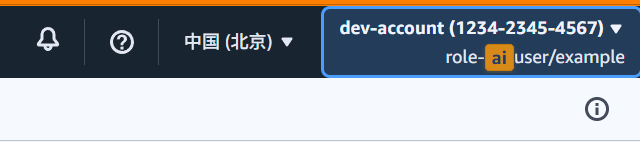

# Enveil - Environment Visual Identifier

> **Status**: Beta / Active Development  
> **Installation**: [Chrome Web Store](https://chromewebstore.google.com/detail/enveil/mnejdnnkcdilfcfkplekhelfelkbjiia) | [GitHub Releases](https://github.com/formaxcn/enveil/releases)

A powerful Chrome extension for developers, DevOps engineers, and QA teams to visually distinguish different environments (Development, Staging, Production) and cloud accounts through configurable banners, overlays, and intelligent URL matching.

## 🚀 Features

### **Visual Environment Identification**
- **Corner Banners**: Rotated ribbons in 4 positions with custom colors and text
- **Background Overlays**: Subtle full-page tinting for critical environments
- **Shadow DOM Isolation**: UI elements don't interfere with page functionality
- **Real-time Updates**: Changes apply immediately without page refresh

### Cloud Environment Highlighting ⭐ NEW
- **AWS Support**: Pre-configured templates for AWS China and AWS Global
- **Account Highlighting**: Visual distinction between different cloud accounts
- **Role Highlighting**: Keyword-based text emphasis for role names
- **Account Selection Pages**: Enhanced indicators on SAML login pages
- **Console Page Highlighting**: Persistent account and role highlighting in AWS Console navigation bar

### **Intelligent URL Matching**
- **5 Matching Strategies**: Domain, URL Prefix, Exact URL, Regex, and smart "Everything" mode
- **Auto-Detection**: Smart pattern recognition with multiple fallback strategies
- **Subdomain Support**: Automatic subdomain matching for domain patterns
- **Regex Power**: Advanced pattern matching for complex scenarios

### **Advanced Configuration Management**
- **Dual-Tab Interface**: Separate tabs for Site Configurations and Cloud Environments
- **Configuration Groups**: Organize rules by project, team, or environment type
- **Group Defaults**: Set default colors, positions, and settings for new sites
- **Import/Export**: Share configurations as JSON files (full, groups, or cloud)
- **Browser Sync**: Cross-device synchronization with conflict resolution
- **10 Default Colors**: Carefully chosen palette optimized for different environments

## 📸 Screenshots

### Configuration Interface


*Cloud environments portal with AWS provider configuration*


*Site configuration portal showing group management*


*Cloud environment configuration with provider selection*

### Visual Indicators


*Example of environment banner displayed on a webpage*


*AWS account selection page with account container highlighting and role keyword emphasis*


*AWS Console navigation bar with account information and role highlighting*

## 📖 Documentation

**Complete documentation available at: [GitHub Pages](https://formaxcn.github.io/enveil/)**

- **[🏠 Home](https://formaxcn.github.io/enveil/)** - Overview and quick start
- **[✨ Features](https://formaxcn.github.io/enveil/features.html)** - Complete feature list
- **[🚀 Getting Started](https://formaxcn.github.io/enveil/getting-started.html)** - Installation and setup
- **[⚙️ Configuration](https://formaxcn.github.io/enveil/configuration.html)** - Detailed configuration guide
- **[🏗️ Architecture](https://formaxcn.github.io/enveil/architecture.html)** - Technical architecture
- **[📚 API Reference](https://formaxcn.github.io/enveil/api-reference.html)** - Developer API docs
- **[🔧 Development](https://formaxcn.github.io/enveil/development.html)** - Development guide
- **[🔒 Security](https://formaxcn.github.io/enveil/security.html)** - Security and privacy

## 🎯 Quick Start

### Installation

**🌐 Install from Chrome Web Store (Recommended)**

The easiest way to install Enveil is from the Chrome Web Store:

1. **Visit**: Go to [Chrome Web Store - Enveil](https://chromewebstore.google.com/detail/enveil/mnejdnnkcdilfcfkplekhelfelkbjiia)
2. **Install**: Click "Add to Chrome" button
3. **Confirm**: Accept the permission request
4. **Verify**: Extension icon should appear in your Chrome toolbar

**📦 Download from GitHub Releases**

Alternatively, you can download pre-built packages from GitHub Releases:

1. **Download**: Go to [GitHub Releases](https://github.com/formaxcn/enveil/releases) and download the latest `enveil-chrome-v*.zip`
2. **Extract**: Unzip the downloaded file to a local folder
3. **Install**: 
   - Open `chrome://extensions/`
   - Enable "Developer mode" (toggle in top-right)
   - Click "Load unpacked"
   - Select the extracted folder
4. **Verify**: Extension icon should appear in your Chrome toolbar

**🛠️ Build from Source (Development)**
```bash
# Clone and build
git clone https://github.com/formaxcn/enveil.git
cd enveil
bun install
bun run build

# Load in Chrome
# 1. Go to chrome://extensions
# 2. Enable Developer mode  
# 3. Click "Load unpacked"
# 4. Select the .output/chrome-mv3 folder
```

### Basic Configuration

1. Click the Enveil icon → **Options**
2. Create a configuration group (e.g., "Work Projects")
3. Add a site rule:
   ```
   Pattern: domain
   Value: localhost
   Environment: DEV
   Color: Blue (#4a9eff)
   Position: Top Right
   ```
4. Visit `http://localhost:3000` and see your banner!

### Cloud Environment Setup

1. Switch to the **"Cloud Environments"** tab
2. Click **"Add Provider"** and select AWS China or AWS Global
3. Add a cloud account:
   ```
   Name: prod-main
   Background Color: Red (#f44336)
   Account Pattern: domain: 123456789012
   ```
4. Add role keywords to highlight (e.g., "Administrator", "ReadOnly")
5. Visit your AWS SAML sign-in page to see the account and role highlighting!
6. After signing in, the highlighting persists in the AWS Console navigation bar

## 🎨 Common Use Cases

### Development Teams
```
🔵 DEV (localhost) - Blue banner, top-right
🟡 STAGING (staging.app.com) - Yellow banner, top-right  
🔴 PROD (app.com) - Red banner + background overlay
```

### API Development
```
🔵 API-V1 (api.example.com/v1) - Blue banner
🟡 API-V2 (api.example.com/v2) - Yellow banner
🔴 API-PROD (api.example.com/prod) - Red banner + overlay
```

### Multi-tenant Applications
```
🔵 CLIENT-A (client-a.app.com) - Blue banner
🟢 CLIENT-B (client-b.app.com) - Green banner
🟠 CLIENT-C (client-c.app.com) - Orange banner
```

### Cloud Environment Management
```
☁️ AWS-Production
├── Account: prod-main (123456789012) - Red background
│   └── Roles: Admin, ReadOnly (yellow highlight)
│   └── Console: Navigation bar highlighting
└── Account: dev-sandbox (987654321098) - Blue background
    └── Roles: Developer, Tester (yellow highlight)
    └── Console: Navigation bar highlighting
```

## 🛠️ Development

### Prerequisites
- **Node.js** (v18+)
- **Bun** (Latest)
- **Chrome** (for testing)

### Development Workflow
```bash
# Install dependencies
bun install

# Development server with hot-reload
bun run dev

# Build for production
bun run build

# Build for Firefox
bun run build:firefox

# Create extension package
bun run zip
```

### Project Structure
```
enveil/
├── entrypoints/          # Extension entry points
│   ├── background.ts     # Service worker
│   ├── content.ts        # Content script
│   ├── popup/           # Extension popup
│   └── options/         # Configuration interface (React + TypeScript)
├── components/          # Reusable UI components
│   ├── CloudHighlighter.ts
│   └── AccountSelectionHighlighter.ts
├── utils/              # Utility functions
│   ├── cloudMatcher.ts
│   └── cloudTemplates.ts
├── docs/               # Documentation (GitHub Pages)
└── public/             # Static assets
```

## 🏗️ Architecture

### Core Components
- **Background Service Worker**: Handles tab events, configuration sync, and URL matching
- **Content Script**: Injects visual indicators using Shadow DOM
- **Options Page**: Comprehensive configuration interface with dual-tab layout
- **Popup**: Quick access and status indicator
- **Cloud Highlighter**: Handles cloud account and role highlighting

### Data Flow
```
User Configuration → Storage → Background Script → 
URL Matching → Content Script → Visual Indicators
```

### Key Technologies
- **Framework**: WXT (Web Extension Tools) with Manifest V3
- **Language**: TypeScript with full type safety
- **UI**: React with Tailwind CSS
- **Storage**: Chrome Storage API (sync for cross-device)
- **Build**: Bun with TypeScript compilation

## 🔒 Privacy & Security

- **100% Local**: All data stored locally or synced via Chrome Storage
- **No Tracking**: Zero analytics or external data collection  
- **No Network**: No external API calls or data transmission
- **Shadow DOM**: Complete style isolation prevents page interference
- **Minimal Permissions**: Only requests `storage` and `tabs` permissions

## 🌟 Browser Support

| Browser | Status | Notes |
|---------|--------|-------|
| **Chrome** | ✅ Full Support | Primary target, all features |
| **Firefox** | ✅ Compatible | Build with `bun run build:firefox` |
| **Edge** | 🔄 Planned | Chromium-based, should work |

> **Note**: Enveil is available on both Chrome Web Store and GitHub Releases.

## 📋 Roadmap

### **Current (v1.0)**
- ✅ Visual indicators (banners, overlays)
- ✅ 5 matching strategies with auto-detection
- ✅ Configuration groups with defaults
- ✅ Import/export system
- ✅ Browser synchronization
- ✅ Cloud environment highlighting (AWS)
- ✅ Account selection page highlighting
- ✅ Role keyword highlighting

### **Near Term (v1.1)**
- 🔄 Complete Shadow DOM implementation
- 🔄 Unit and E2E test coverage
- 🔄 Enhanced Options page UX
- 🔄 Rule testing tools

### **Future (v2.0+)**
- 📋 Azure and GCP support
- 📋 Drag & drop rule reordering
- 📋 Conditional logic (AND/OR)
- 📋 Time-based rules
- 📋 Plugin architecture

## 🤝 Contributing

Contributions welcome! Whether fixing bugs, adding features, improving docs, or sharing templates.

### Ways to Contribute
- 🐛 **Bug Reports**: Found an issue? Let us know!
- 💡 **Feature Requests**: Have an idea? We'd love to hear it!
- 🔧 **Code**: Submit pull requests for fixes and features
- 📚 **Documentation**: Help improve our docs and examples
- 🎨 **Templates**: Share useful configuration templates

### Development Setup
```bash
git clone https://github.com/formaxcn/enveil.git
cd enveil
bun install
bun run dev
```

## 📄 License

MIT License - see [LICENSE](./LICENSE) for details.

---

**Never work on the wrong environment again!** 🎯

**🌐 [Install from Chrome Web Store](https://chromewebstore.google.com/detail/enveil/mnejdnnkcdilfcfkplekhelfelkbjiia)** | **📦 [Download from GitHub Releases](https://github.com/formaxcn/enveil/releases)** | [📖 Read the Docs](https://formaxcn.github.io/enveil/) | [🚀 Get Started](https://formaxcn.github.io/enveil/getting-started.html) | [⚙️ Configuration Guide](https://formaxcn.github.io/enveil/configuration.html)
