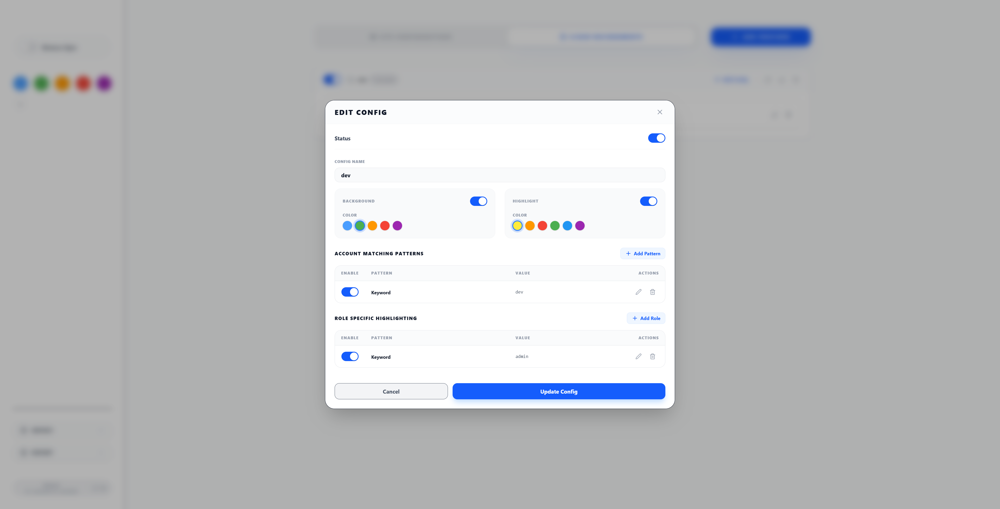
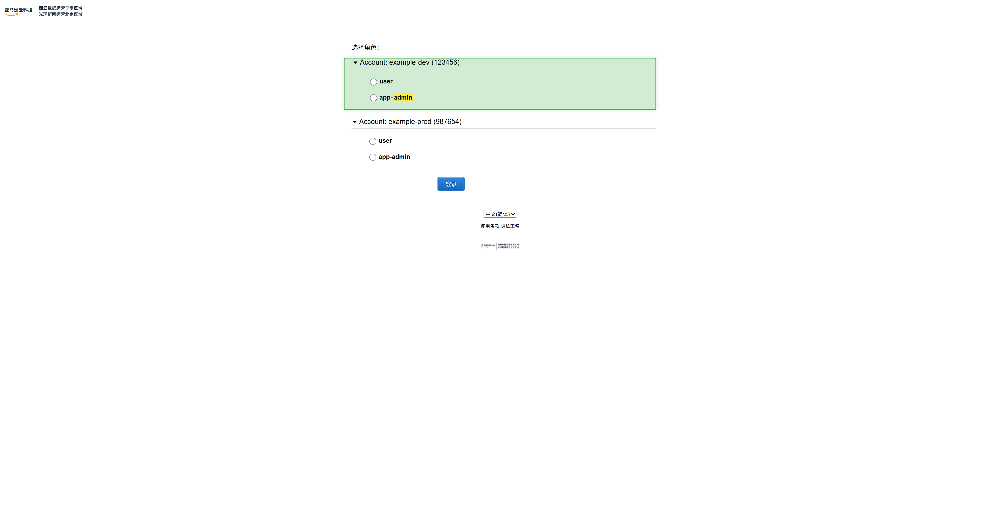
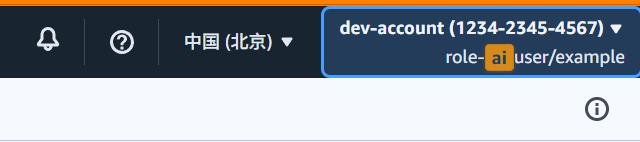
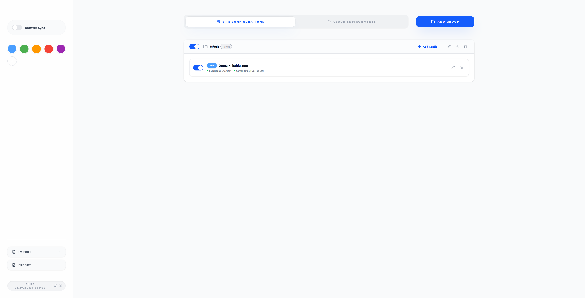
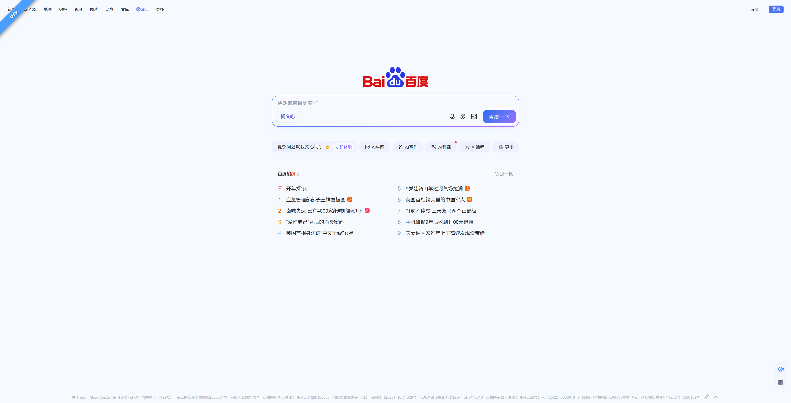
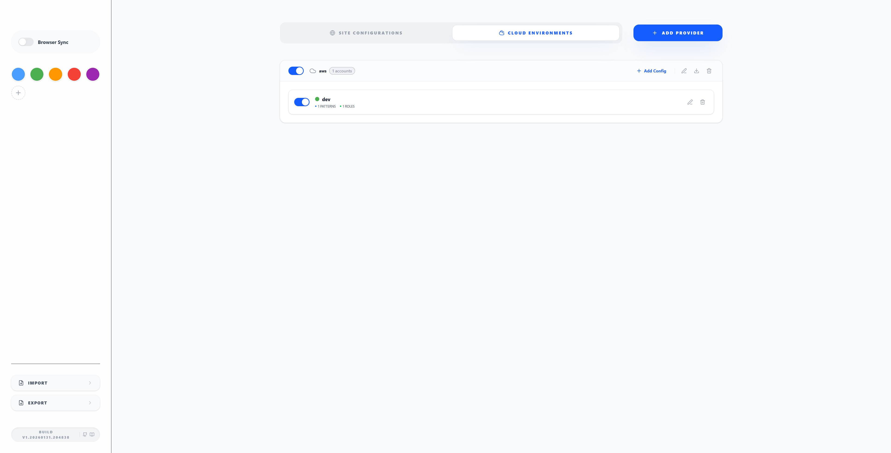
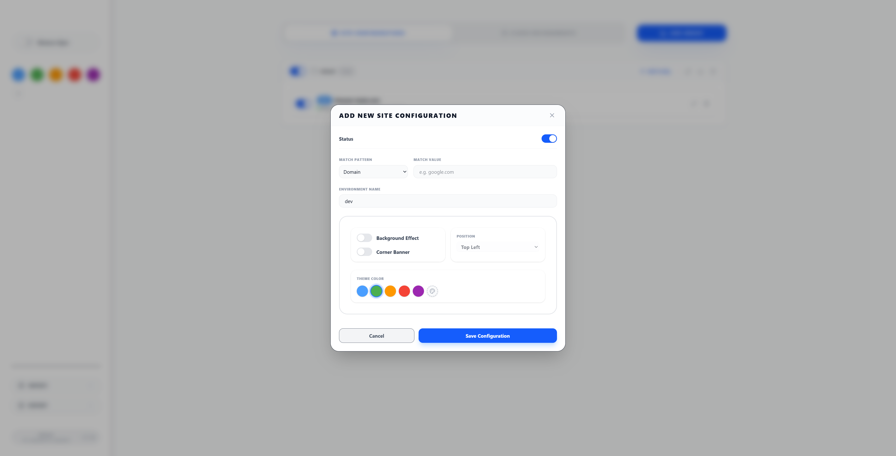
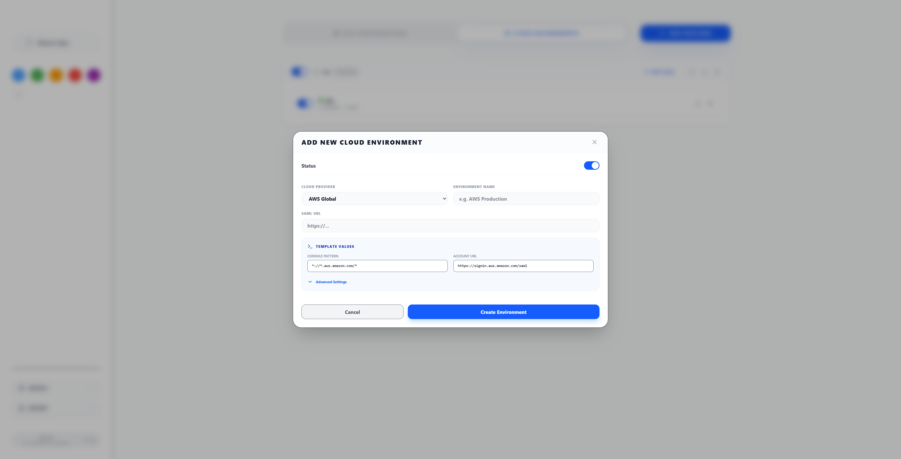
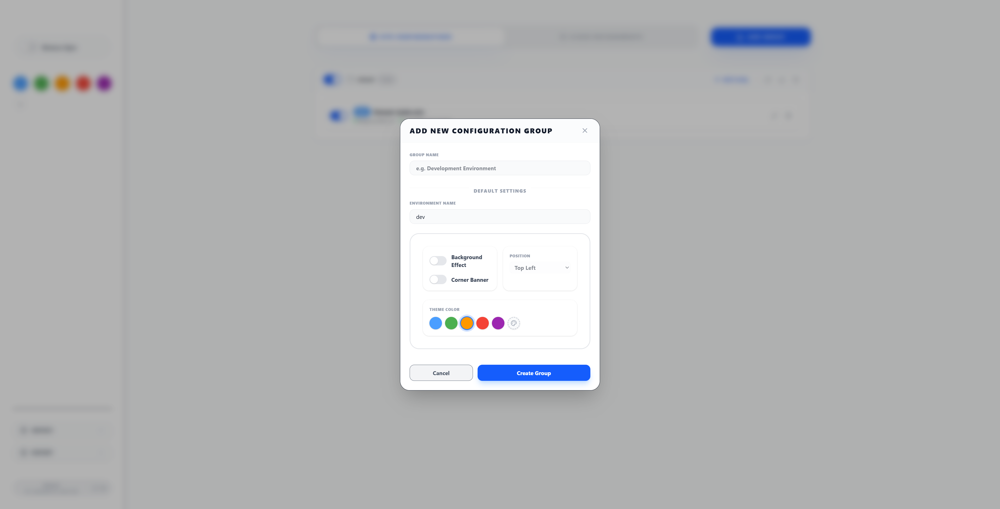

# Features Overview

Enveil provides comprehensive environment identification through visual indicators and intelligent URL matching. Here's a complete overview of all features available in the extension.

## Core Features

### ☁️ Cloud Environment Highlighting
**Advanced cloud platform environment and role identification**

Enveil supports intelligent cloud environment visualization for multiple cloud providers with unified configuration and highlighting system.

#### Three-Tier Cloud Configuration
- **Cloud Providers**: Top-level grouping for cloud platforms (AWS China, AWS Global)
- **Cloud Accounts**: Account-level configuration with background highlighting and role management
- **Cloud Roles**: Role-specific keyword-based text highlighting

#### Dual-Layer Visual System
- **Account Background Highlighting**: Subtle full-page overlay for account identification (25% opacity with border)
- **Role Text Highlighting**: Keyword-based text emphasis for role names and descriptions (yellow highlight)
- **Visual Hierarchy**: Account background as base layer, role text as overlay layer


*Cloud environment configuration interface showing provider selection and account management*

#### Cloud Provider Templates
- **AWS China (CN)**: Pre-configured for `https://signin.amazonaws.cn/saml` and `*.amazonaws.cn/*`
- **AWS Global**: Support for global AWS environments with `https://signin.aws.amazon.com/saml`
- **Aliyun (Alibaba Cloud)**: Support for Alibaba Cloud with SSO account selection and console highlighting
- **Volcengine**: Support for Volcengine cloud platform
- **Huawei Cloud**: Support for Huawei Cloud with SAML login and console highlighting
- **Custom Providers**: Flexible configuration for any cloud platform with custom selectors

#### Smart Cloud Detection
- **Account Selection Pages**: Enhanced visual indicators on SAML login pages with account container highlighting
- **Console Page Highlighting**: Persistent account and role highlighting in AWS Console navigation bar
- **Dynamic Content**: Mutation observer handles dynamically loaded content
- **Cross-Page Consistency**: Maintains highlighting across navigation


*AWS account selection page with account container highlighting and role keyword emphasis*


*AWS Console navigation bar with account information and role highlighting*

### ✨ Magic Relogin
**One-click automatic re-login for expired cloud sessions**

When your cloud console session expires, Enveil detects the logout dialog and injects a "Magic Relogin" button for seamless re-authentication.

#### Key Features
- **Automatic Detection**: Monitors for session expiration dialogs in real-time
- **One-Click Relogin**: Single button to trigger SAML re-authentication
- **Account & Role Preservation**: Automatically selects the same account and role you were using
- **Cross-Tab Communication**: Coordinates between SAML login page and console tab
- **SAML URL Configuration**: Customizable IdP login URL per environment

#### How It Works
1. **Detection Phase**: Mutation observer continuously monitors the page for logout dialogs
2. **UI Injection**: When detected, injects a gradient "Relogin" button alongside the native login button
3. **State Preservation**: Extracts current account ID and role information from the page
4. **Cross-Tab Flow**:
   - Opens configured SAML IdP login page in new tab
   - Passes account/role information via local storage
   - Account selection handler automatically selects the correct account
   - Automatically selects the matching role
   - Triggers login and returns to original console page
5. **Completion**: Refreshes the original console tab with restored session

#### Supported Platforms
- **AWS China**: Full support with account/role preservation
- **AWS Global**: Full support with account/role preservation
- **Generic Platforms**: Extensible architecture for other cloud providers

### 🎯 Intelligent URL Matching
**Five sophisticated matching strategies for maximum flexibility**

- **Everything (Auto-Match)**: Intelligent pattern detection with multiple fallback strategies
- **Domain Matching**: Hostname-based with subdomain support
- **URL Prefix**: Path-based matching for specific sections
- **Exact URL**: Precise page targeting
- **Regex**: Advanced pattern matching with JavaScript RegExp

### 🎨 Visual Indicators
**Multiple ways to identify environments visually**

#### Corner Banners
- **4 Positions**: Top-left, top-right, bottom-left, bottom-right
- **Customizable**: Colors, text, and positioning
- **Rotated Design**: 45-degree angled ribbons for visibility
- **Shadow DOM**: Isolated from page styles to prevent conflicts


*Site configuration portal showing group management and site rules*

#### Background Overlays
- **Subtle Tinting**: 5% opacity full-page color overlay for sites, 25% for cloud accounts
- **Non-intrusive**: Doesn't interfere with page functionality
- **Configurable**: Enable/disable per rule
- **Perfect for Production**: Subtle warning for dangerous environments


*Example of environment banner displayed on a webpage*

### 📁 Configuration Management
**Organize rules logically for better management**

#### Dual-Tab Interface
The configuration page features two main tabs:

1. **Site Configurations**: Traditional URL-based environment identification
2. **Cloud Environments**: Cloud provider account and role highlighting


*Cloud environments portal showing configured cloud providers*

#### Traditional Site Configuration
- **Hierarchical Structure**: Groups contain multiple site rules
- **Group Defaults**: Set default colors, positions, and settings
- **Bulk Operations**: Enable/disable entire groups at once
- **Export Individual Groups**: Share specific project configurations


*Site group item showing multiple environment rules*

#### Cloud Configuration System
- **Cloud Environments**: Organize by cloud provider and environment type
- **Account Management**: Configure cloud accounts with URL patterns and background colors
- **Role Management**: Define keyword-based role highlighting within accounts
- **Template Integration**: Quick setup using pre-configured cloud provider templates


*Cloud portal showing environment details and account list*


*Site configuration showing grouped environment rules*

### 🎨 Advanced Color System
**Comprehensive color management**

#### Default Palette
10 predefined colors optimized for different environments:
- Blue (`#4a9eff`) - Development
- Green (`#4CAF50`) - Staging  
- Orange (`#ff9800`) - Testing
- Red (`#f44336`) - Production
- Purple, Cyan, Yellow, Brown, Blue Grey, Pink

#### Custom Colors
- **Color Picker**: Full spectrum selection
- **Hex Input**: Direct color code entry
- **Unlimited Colors**: No restrictions on color count
- **Contrast Optimization**: Automatic text color selection

## Management Features

### 📋 Log Viewer
**Built-in diagnostic logging system for troubleshooting**

Enveil includes a comprehensive logging system that records all extension activities for debugging and monitoring purposes.

#### Logging Features
- **Multi-Level Logging**: Supports 5 log levels: `log`, `info`, `warn`, `error`, `debug`
- **Component-Based Tagging**: Each log entry is tagged by source component for easy filtering
- **Structured Data Logging**: Supports additional data payloads with each log entry
- **Timestamps**: Millisecond precision timestamps for all log entries
- **Persistent Storage**: Logs are stored in memory and synced with background script

#### Log Viewer Interface
- **Slide-in Panel**: Full-height modal panel from the right side of the screen
- **Real-Time Updates**: Logs stream in automatically as events occur
- **Search Functionality**: Full-text search across all log messages and components
- **Level Filtering**: Filter by log severity level
- **Component Filtering**: Filter by source component with grouped component categories
- **Auto-Scroll**: Optional auto-scroll to newest log entries
- **Expandable Details**: Click to expand and view structured data payloads
- **Color-Coded**: Visual color coding for quick severity identification

#### Management Actions
- **Export Logs**: Download all logs as JSON file with timestamped filename
- **Clear Logs**: One-click to clear all log entries (with confirmation)
- **Background Sync**: Logs are fetched from background service worker for complete visibility

#### Component Categories
- **Cloud Highlighter**: Cloud environment highlighting operations
- **Account Selection Handlers**: Account selection page processing
- **Magic Relogin Handler**: Re-login flow operations
- **Content Script**: Page injection and DOM manipulation
- **Background Script**: Service worker events
- **Options UI**: Configuration interface operations
- **Configuration Management**: Import/export/sync operations

### 📤 Import/Export System
**Flexible configuration sharing and backup**

#### Export Options
- **Full Configuration**: Complete setup with all groups and cloud environments (`enveil-config-YYYY-MM-DD.json`)
- **Individual Groups**: Single group export (`enveil-group-{name}.json`)
- **Cloud Environments**: Export cloud configurations separately (`enveil-cloud-{name}.json`)
- **Automatic Naming**: Intelligent filename generation with timestamps

#### Import Options
- **Full Import**: Replace entire configuration including cloud environments (with confirmation)
- **Group Import**: Add groups to existing configuration
- **Cloud Import**: Import cloud environment configurations
- **Conflict Resolution**: Automatic handling of duplicate names
- **Validation**: Complete configuration integrity checking including cloud configurations

### 🔄 Browser Synchronization
**Cross-device configuration synchronization**

#### Sync Features
- **Real-time Updates**: Changes propagate immediately across devices
- **Chrome Storage Sync**: Built on Chrome's native sync infrastructure
- **Complete Configuration**: Syncs both traditional site rules and cloud environments
- **Conflict Detection**: Intelligent handling of simultaneous edits
- **Version Control**: Timestamp-based conflict resolution

#### Conflict Resolution
- **Automatic Detection**: Identifies configuration conflicts
- **User Choice**: Options to keep local, use remote, or merge
- **Backup Creation**: Automatic backup before applying changes
- **5-minute Threshold**: Smart conflict detection timing

### ⚙️ Advanced Configuration
**Power user features for complex setups**

#### URL Parameters
Quick actions via URL parameters:
```
?action=addSite&domain=example.com&pattern=domain
```

#### Configuration Migration
- **Automatic Detection**: Identifies old configuration formats
- **Safe Migration**: Creates backups before updating
- **Schema Validation**: Ensures data integrity

## User Interface Features

### 🖥️ Options Page
**Comprehensive configuration interface**

#### Layout
- **Split Panel**: 30% left panel for global settings, 70% right for configurations
- **Responsive Design**: Minimum 1200px width for optimal experience
- **Dark/Light Theme**: Automatic theme detection and support
- **Tabbed Interface**: Separate tabs for traditional sites and cloud environments

#### Components
- **Real-time Preview**: Live preview of banners and overlays
- **Form Validation**: Real-time validation with error feedback
- **Modal Dialogs**: Intuitive add/edit interfaces for sites and cloud configurations
- **Cloud Roles Tab**: Dedicated interface for cloud environment management
- **Role Management Table**: Inline role configuration within cloud account modals

### 🔧 Popup Interface
**Quick access and control**

- **Global Toggle**: Enable/disable extension instantly
- **Current Site Status**: Shows if current page matches any rules
- **Quick Add**: Add current site with pre-filled domain
- **Options Access**: Direct link to full configuration

### 🎛️ Component System
**Reusable UI components for consistency**

#### Switch Components
- **Standardized Toggles**: Consistent on/off switches
- **Storage Integration**: Automatic persistence
- **Change Callbacks**: Real-time update handling

#### Preview Components
- **Live Preview**: Real-time banner and overlay preview
- **Interactive**: Click to test different positions and colors
- **Integrated**: Used in all configuration dialogs

## Technical Features

### 🔒 Security & Privacy
**Privacy-first design with robust security**

#### Data Privacy
- **Local Storage**: All data stored locally or synced via Chrome
- **No Tracking**: Zero analytics or data collection
- **No External Calls**: No network requests to external services

#### Security Measures
- **Shadow DOM**: Complete style isolation for injected UI
- **Input Validation**: Comprehensive validation of all user inputs
- **CSP Protection**: Content Security Policy prevents code injection
- **Minimal Permissions**: Only requests necessary browser permissions

### ⚡ Performance Optimization
**Efficient operation with minimal impact**

#### Matching Optimization
- **First Match Wins**: Stops processing after first successful match
- **Rule Ordering**: Processes rules in order for optimal performance
- **Lazy Loading**: Components loaded only when needed

#### Memory Management
- **Event Cleanup**: Proper removal of event listeners
- **Minimal Storage**: Efficient data structure design
- **Background Efficiency**: Event-driven processing only

### 🛠️ Development Features
**Built for developers, by developers**

#### WXT Framework
- **Modern Tooling**: Built with WXT (Web Extension Tools)
- **TypeScript**: Full type safety and IntelliSense support
- **Hot Reload**: Automatic extension reload during development
- **Multi-browser**: Chrome and Firefox support

#### Build System
- **Automatic Manifest**: Generates Manifest V3 automatically
- **Asset Optimization**: Icon processing and optimization
- **Source Maps**: Full debugging support in development

## Integration Features

### 🌐 Browser Integration
**Seamless browser experience**

#### Extension Icon
- **Dynamic Icons**: Colored when matching, gray when not
- **Per-tab Icons**: Different icon states per browser tab
- **Visual Feedback**: Instant visual confirmation of rule matching

#### Content Script Integration
- **Universal Injection**: Works on all websites (`<all_urls>`)
- **Non-intrusive**: Doesn't affect page functionality
- **Real-time Updates**: Updates immediately when configuration changes

### 📱 Cross-platform Support
**Works across different environments**

#### Browser Support
- **Chrome**: Full feature support (primary target)
- **Firefox**: Compatible build available
- **Manifest V3**: Future-proof extension format

#### Operating System
- **Windows**: Full compatibility
- **macOS**: Native support
- **Linux**: Complete functionality

## Cloud Environment Use Cases

### AWS Multi-Account Setup
```
☁️ AWS-Production
├── Account: prod-main (123456789012) - Red background
│   └── Roles: Admin, ReadOnly
├── Account: prod-security (123456789013) - Orange background
│   └── Roles: SecurityAdmin, Auditor
└── Account: prod-logging (123456789014) - Yellow background
    └── Roles: LogAdmin

☁️ AWS-Development  
├── Account: dev-sandbox (987654321098) - Blue background
│   └── Roles: Developer, Tester
└── Account: dev-shared (987654321099) - Green background
    └── Roles: DevOps, Admin
```

### Account Selection Page Highlighting
When on AWS SAML sign-in pages:
- **Account Containers**: Highlighted with configured background color (25% opacity with border)
- **Role Names**: Keywords highlighted in yellow (e.g., "Admin", "ReadOnly")
- **Visual Distinction**: Different accounts have different background colors
- **Quick Identification**: Instantly find the right account/role combination

### Console Page Highlighting
When in AWS Console, the highlighting persists in the navigation bar:
- **Navigation Bar Highlighting**: Account information container highlighted with configured background color
- **Role Text Highlighting**: Role keywords highlighted in yellow within the navigation bar
- **Account Info Display**: Account name/ID and role information visually distinguished
- **Persistent**: Maintains highlighting across page navigation and service switches
- **Dynamic Updates**: Automatically updates when switching accounts or roles

## Planned Features

### 🚀 Upcoming Enhancements
**Features in development or planned**

#### ✅ Completed
- **Alibaba Cloud (Aliyun)**: Aliyun support (Implemented)
- **Volcengine**: Volcengine cloud platform support (Implemented)
- **Huawei Cloud**: Huawei Cloud support (Implemented)
- **Magic Relogin**: Automatic session re-login (Implemented)
- **Log Viewer**: Built-in diagnostic logging system (Implemented)

#### Testing Suite
- **Unit Tests**: Comprehensive test coverage
- **E2E Tests**: End-to-end functionality testing
- **Pattern Testing**: Built-in regex and pattern testing tools

#### UI Enhancements
- **Drag & Drop**: Reorder rules and groups
- **Rule Templates**: Pre-built rule templates for common scenarios
- **Bulk Edit**: Edit multiple rules simultaneously
- **Advanced Search**: Search and filter rules

#### Advanced Matching
- **Conditional Logic**: AND/OR operations for complex rules
- **Time-based Rules**: Rules active only during certain times
- **User Agent Matching**: Match based on browser or device type
- **Cookie-based Rules**: Match based on cookie presence/values

#### More Cloud Providers
- **Azure**: Microsoft Azure cloud platform support
- **Google Cloud Platform**: GCP environment configuration
- **Custom Providers**: User-defined provider templates

## Feature Comparison

| Feature | Basic Use | Advanced Use | Power User |
|---------|-----------|--------------|------------|
| URL Matching | Domain, URL | Regex, Prefix | Everything (Auto) |
| Visual Indicators | Corner Banners | + Background Overlay | + Custom Positions |
| Configuration | Single Rules | Groups | + Defaults, Sync |
| Management | Manual Setup | Import/Export | + Browser Sync |
| Customization | Basic Colors | Custom Colors | + Unlimited Palette |
| Cloud Support | - | AWS | + Multi-Provider |

## Getting the Most from Enveil

### Best Practices
1. **Start Simple**: Begin with domain matching for basic needs
2. **Organize Logically**: Use groups to separate different projects or teams
3. **Color Code Consistently**: Use the same colors for similar environments across projects
4. **Test Patterns**: Use the preview feature to test complex regex patterns
5. **Export Regularly**: Create backups of your configuration
6. **Cloud Setup**: Use templates for quick cloud provider configuration
7. **Role Keywords**: Use specific keywords for role highlighting (e.g., "Administrator" not "Admin")

### Common Use Cases
- **Development Teams**: Separate dev/staging/prod environments
- **QA Testing**: Identify different testing environments
- **Client Work**: Distinguish between different client projects
- **API Development**: Identify different API versions or endpoints
- **Multi-tenant Applications**: Distinguish between different tenants or instances
- **Cloud Management**: Visual distinction between AWS accounts and roles
- **Security Compliance**: Highlight production accounts with warning colors

Enveil is designed to grow with your needs, from simple domain matching to complex multi-environment setups with advanced synchronization and management features.
