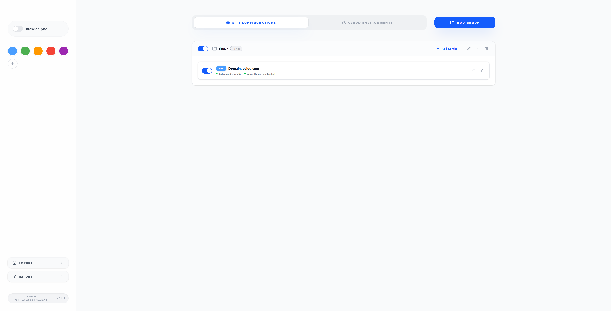

# Getting Started

Welcome to Enveil! This guide will help you get up and running with both site-based environment identification and cloud environment highlighting.

## Installation

### From Chrome Web Store (Recommended)

1. Visit [Chrome Web Store - Enveil](https://chromewebstore.google.com/detail/enveil/mnejdnnkcdilfcfkplekhelfelkbjiia)
2. Click **"Add to Chrome"**
3. Confirm the installation
4. The Enveil icon will appear in your Chrome toolbar

### From GitHub Releases

1. Go to [GitHub Releases](https://github.com/formaxcn/enveil/releases)
2. Download the latest `enveil-chrome-v*.zip`
3. Extract the ZIP file to a folder
4. Open Chrome and navigate to `chrome://extensions/`
5. Enable **Developer mode** (toggle in top-right)
6. Click **"Load unpacked"**
7. Select the extracted folder

### Build from Source

```bash
# Clone the repository
git clone https://github.com/formaxcn/enveil.git
cd enveil

# Install dependencies
bun install

# Build for Chrome
bun run build

# The extension will be in .output/chrome-mv3/
```

## First-Time Setup

### Opening the Options Page

1. Click the Enveil icon in your Chrome toolbar
2. Select **"Options"** from the popup menu
3. The configuration page will open in a new tab


*Enveil configuration interface with dual-tab layout*

### Understanding the Interface

The configuration page has two main tabs:

1. **Site Configurations** - For traditional URL-based environment identification
2. **Cloud Environments** - For cloud provider account and role highlighting

The left sidebar contains:
- **Browser Sync** toggle for cross-device synchronization
- **Color Palette** for customizing available colors
- **Import/Export** buttons for configuration backup and sharing

## Quick Start: Site Configuration

### Step 1: Create a Configuration Group

1. Stay on the **"Site Configurations"** tab
2. Click the **"Add Group"** button
3. Enter a name like "Development Environments"
4. Set default colors and settings for the group
5. Click **Save**


*Site configuration portal showing groups and rules*

### Step 2: Add Your First Site Rule

1. Inside your new group, click **"Add Site"**
2. Configure the rule:
   - **Match Pattern**: `domain`
   - **Match Value**: `localhost`
   - **Environment Name**: `DEV`
   - **Color**: Blue (`#4a9eff`)
   - **Position**: `rightTop`
   - **Banner**: Enable ✓
   - **Background**: Disable ✗
3. Click **Save**


*Site group with multiple environment rules*

### Step 3: Test Your Configuration

1. Visit `http://localhost:3000` (or any localhost site)
2. You should see a blue "DEV" banner in the top-right corner


*Example of environment banner displayed on a webpage*

## Quick Start: Cloud Environment Configuration

### Step 1: Add a Cloud Provider

1. Switch to the **"Cloud Environments"** tab
2. Click the **"Add Provider"** button
3. Select a provider template:
   - **AWS China**: For `*.amazonaws.cn` domains
   - **AWS Global**: For `*.aws.amazon.com` domains
   - **Custom**: For other cloud providers
4. Enter a name like "Production AWS"
5. Click **Save**


*Cloud environment configuration with provider selection*

### Step 2: Add a Cloud Account

1. In your cloud environment, click **"Add Account"**
2. Configure the account:
   - **Name**: `prod-main`
   - **Background Color**: Red (`#f44336`) for production warning
   - **Account Patterns**: Add patterns to match your account
3. Add account patterns:
   - **Pattern**: `domain`
   - **Value**: Your 12-digit AWS account ID (e.g., `123456789012`)
4. Click **Save**

### Step 3: Add Role Highlighting (Optional)

1. Edit your cloud account
2. Add role keywords to highlight:
   - **Match Pattern**: `contains`
   - **Match Value**: `Administrator`
3. Add more roles as needed (e.g., `ReadOnly`, `PowerUser`)
4. Click **Save**

### Step 4: Test Cloud Highlighting

1. Visit your AWS SAML sign-in page (e.g., `https://signin.amazonaws.cn/saml`)
2. Your configured accounts should be highlighted with background colors
3. Role names matching your keywords should be highlighted in yellow


*AWS account selection page with account highlighting and role keyword emphasis*

## Common Configurations

### Development Team Setup

```
Site Configurations
├── "Work Projects" Group
│   ├── localhost → DEV (Blue)
│   ├── dev.company.com → DEV (Blue)
│   ├── staging.company.com → STAGING (Yellow)
│   └── company.com → PROD (Red + Background)
└── "Personal Projects" Group
    ├── localhost:3000 → DEV (Green)
    └── *.test → TEST (Orange)
```

### AWS Multi-Account Setup

```
Cloud Environments
├── "Production AWS" (AWS China)
│   ├── prod-main (123456789012) → Red background
│   │   └── Roles: Administrator, FullAccess
│   └── prod-security (123456789013) → Orange background
│       └── Roles: SecurityAdmin, Auditor
└── "Development AWS" (AWS China)
    ├── dev-sandbox (987654321098) → Blue background
    │   └── Roles: Developer, Tester
    └── dev-shared (987654321099) → Green background
        └── Roles: DevOps, ReadOnly
```

## Configuration Tips

### Color Coding Best Practices

| Environment | Color | Use Case |
|-------------|-------|----------|
| Development | Blue | Local development, safe to experiment |
| Staging | Green | Pre-production testing |
| Testing | Orange/ Yellow | QA and test environments |
| Production | Red | Live environments, requires caution |

### Pattern Selection Guide

- **Domain** (`domain`): Use for matching entire websites and subdomains
- **URL Prefix** (`urlPrefix`): Use for API versions or specific sections
- **Exact URL** (`url`): Use for single specific pages
- **Regex** (`regex`): Use for complex matching scenarios
- **Everything** (`everything`): Use for intelligent auto-detection

### Cloud Account Pattern Examples

**Match by Account ID:**
```
Pattern: domain
Value: 123456789012
```

**Match by Account Name:**
```
Pattern: contains
Value: production-main
```

**Match Multiple Accounts:**
```
Pattern: regex
Value: (123456789012|987654321098)
```

## Troubleshooting

### Site Banner Not Showing?

1. **Check if extension is enabled**: Look for the Enveil icon in your toolbar
2. **Verify URL pattern**: Make sure the pattern matches your current URL
3. **Check group/site is enabled**: Both group and site need to be enabled
4. **Refresh the page**: Content scripts may need a page refresh after installation

### Cloud Highlighting Not Working?

1. **Verify provider template**: Make sure you selected the correct AWS region
2. **Check account patterns**: Ensure account ID or name patterns are correct
3. **Enable account highlighting**: Make sure "Background Enable" is checked
4. **Check page URL**: Cloud highlighting only works on configured domains

### Configuration Not Saving?

1. **Check browser storage permissions**: Enveil needs storage permission
2. **Verify valid values**: All fields must have valid values
3. **Check for errors**: Open browser console (F12) for error messages

## Next Steps

- Learn about [Advanced Configuration](./configuration.html)
- Explore all [Features](./features.html)
- Read the [Architecture Overview](./architecture.html)
- Set up [Browser Synchronization](./configuration.html#browser-synchronization)

## Getting Help

- **Documentation**: [https://formaxcn.github.io/enveil/](https://formaxcn.github.io/enveil/)
- **GitHub Issues**: [https://github.com/formaxcn/enveil/issues](https://github.com/formaxcn/enveil/issues)
- **Chrome Web Store**: Leave a review or report issues

---

**Ready to eliminate environment confusion?** Enveil helps you instantly identify which environment you're working in, preventing costly mistakes and improving your development workflow.
