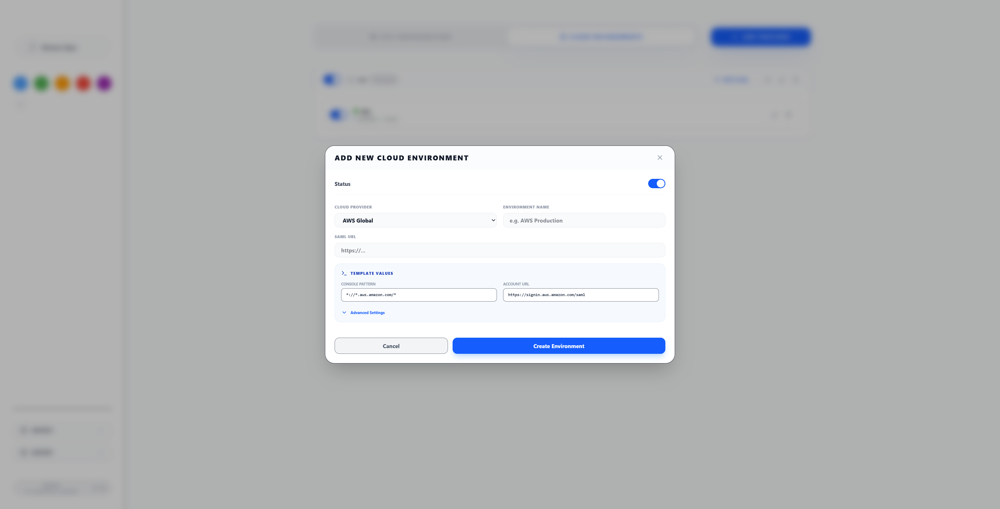

# Enveil - Environment Visual Identifier

> **Enveil** = **En**vironment + **Veil** — A Chrome extension that drapes a visual veil over your web environments, helping developers instantly identify whether they're on DEV, STAGING, or PRODUCTION.

[](https://chromewebstore.google.com/detail/enveil/mnejdnnkcdilfcfkplekhelfelkbjiia)
[](https://github.com/formaxcn/enveil/releases)
[](./LICENSE)

## 🚀 Core Features

### 🎯 Intelligent URL Matching
- **5 Matching Strategies**: Domain, URL prefix, exact URL, regex, and smart "everything" mode
- **Subdomain Support**: Automatically matches subdomains when using domain patterns
- **Regex Power**: Advanced pattern matching for complex scenarios

### 🎨 Flexible Visual Indicators
- **Corner Banners**: Rotated ribbons in any of 4 corners with custom text and colors
- **Background Overlays**: Subtle full-page color tinting (5% opacity) for dangerous environments
- **Shadow DOM Isolation**: UI elements don't interfere with page functionality or styles

### ☁️ Cloud Environment Highlighting
- **Multi-Cloud Support**: Environment identification for AWS China, AWS Global, and custom providers
- **Account Background Highlighting**: Background color differentiation for different cloud accounts
- **Role Text Highlighting**: Keyword-based highlighting of role names and descriptions
- **Account Selection Page Support**: Enhanced visual indicators on SAML login pages


*Cloud environments portal with AWS provider configuration*

### 📁 Configuration Management
- **Dual-Tab Interface**: Separate tabs for Site Configurations and Cloud Environments
- **Logical Organization**: Group related rules by project, team, or environment type
- **Group Defaults**: Set default colors, positions, and settings for new sites
- **Bulk Operations**: Enable/disable entire groups with one click


*Site configuration portal showing group management*

## 📚 Documentation Navigation

### [🚀 Getting Started](./getting-started/)
- [Installation Guide](./getting-started/installation.html)
- [First Setup](./getting-started/first-setup.html)

### [📖 User Guide](./user-guide/)
- [Basic Configuration](./user-guide/basic-configuration.html)
- [Cloud Environments](./user-guide/cloud-environments.html)

### [⚙️ Configuration](./configuration.html)
- [Site Configuration](./configuration.html#site-configuration)
- [Cloud Environment Configuration](./configuration.html#cloud-environment-configuration)
- [Import/Export](./configuration.html#importexport-system)
- [Browser Sync](./configuration.html#browser-synchronization)

### [✨ Features](./features.html)
- [Core Features](./features.html#core-features)
- [Cloud Environment Use Cases](./features.html#cloud-environment-use-cases)
- [Feature Comparison](./features.html#feature-comparison)

### [🛠️ Developer Documentation](./developer/)
- [Architecture](./developer/architecture.html)
- [Development Setup](./developer/development-setup.html)

## 🎯 Common Use Cases

### Development Teams
```
🔵 DEV (localhost) - Blue banner, top-right
🟡 STAGING (staging.app.com) - Yellow banner, top-right  
🔴 PROD (app.com) - Red banner + background overlay, top-right
```


*Example of environment banner displayed on a webpage*

### QA Testing
```
🟢 TEST-1 (test1.example.com) - Green banner
🟠 TEST-2 (test2.example.com) - Orange banner
🟣 UAT (uat.example.com) - Purple banner
```

### Cloud Environment Management
```
☁️ AWS-Production
├── Account: prod-main (123456789012) - Red background
│   └── Roles: Admin, ReadOnly (yellow highlight)
└── Account: dev-sandbox (987654321098) - Blue background
    └── Roles: Developer, Tester (yellow highlight)
```


*AWS account selection page with account highlighting and role keyword emphasis*

## 🔧 Technical Features

- **Modern Tech Stack**: Built with WXT framework, TypeScript, React
- **High Performance**: First match wins, event-driven processing
- **Privacy First**: 100% local storage, no external data collection
- **Cross-Device Sync**: Chrome browser sync support
- **Shadow DOM**: Complete style isolation prevents page interference

## 📊 Browser Support

| Browser | Status | Notes |
|---------|--------|-------|
| **Chrome** | ✅ Full Support | Primary target platform, all features |
| **Firefox** | ✅ Compatible | Build with `bun run build:firefox` |
| **Edge** | 🔄 Planned | Chromium-based, should work |

## 🎨 Screenshots

### Configuration Interface


*Cloud environment configuration with provider selection and account management*


*Site group item showing multiple environment rules*


*Cloud portal showing environment details and account list*


*Site configuration showing grouped environment rules*

## 🤝 Contributing

Enveil is open source and welcomes contributions! Whether you're fixing bugs, adding features, improving documentation, or sharing configuration templates, your help is appreciated.

[View Contributing Guide](./developer/contributing.html) | [GitHub Repository](https://github.com/formaxcn/enveil)

---

**Ready to eliminate environment confusion?** Install Enveil and never accidentally work on the wrong environment again!

[🌐 Install from Chrome Web Store](https://chromewebstore.google.com/detail/enveil/mnejdnnkcdilfcfkplekhelfelkbjiia){: .btn .btn-primary .fs-5 .mb-4 .mb-md-0 .mr-2 }
[📦 Download from GitHub Releases](https://github.com/formaxcn/enveil/releases){: .btn .btn-primary .fs-5 .mb-4 .mb-md-0 .mr-2 }
[Get Started](./getting-started/){: .btn .fs-5 .mb-4 .mb-md-0 .mr-2 }
[View on GitHub](https://github.com/formaxcn/enveil){: .btn .fs-5 .mb-4 .mb-md-0 }
