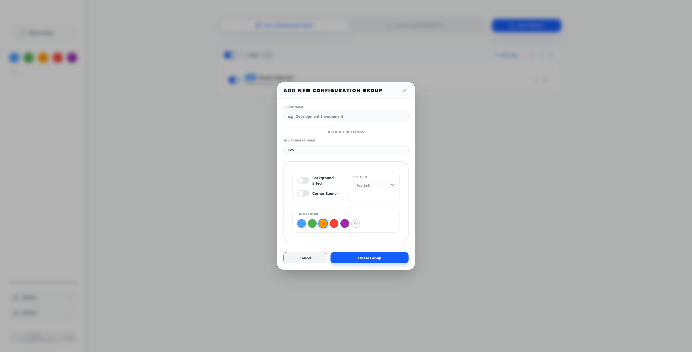
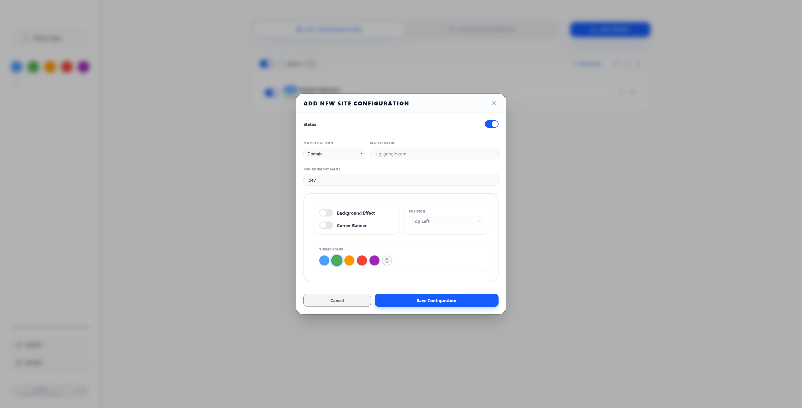
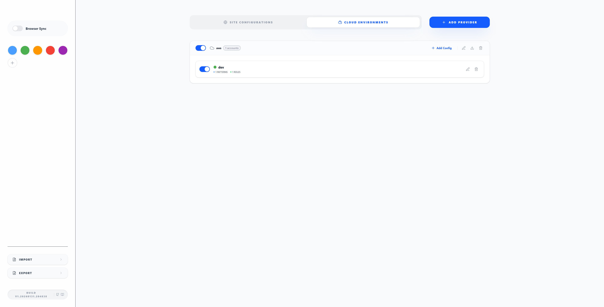
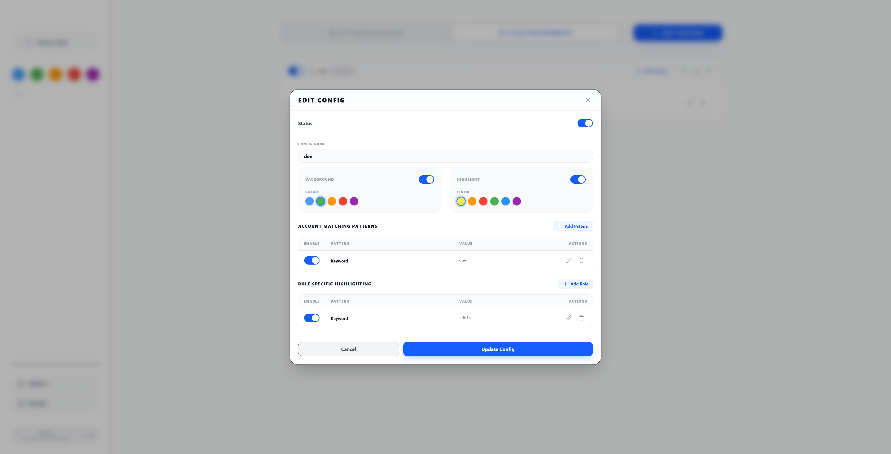
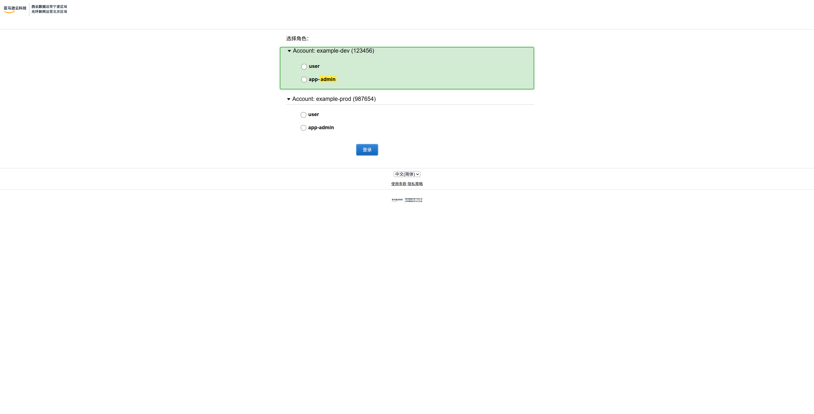
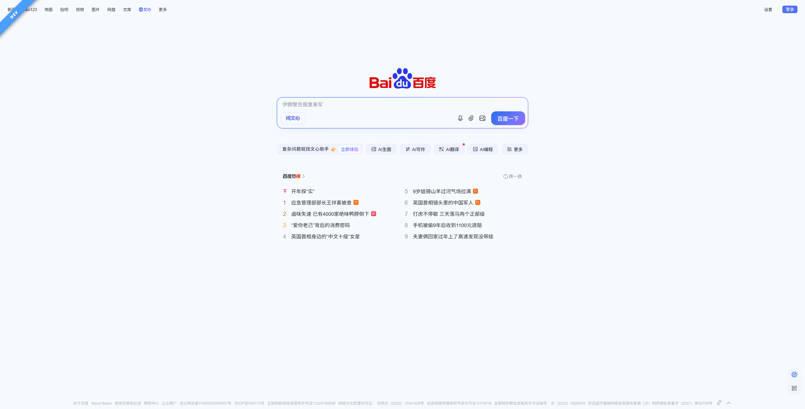

# Basic Configuration

This guide covers the fundamental concepts and setup procedures for Enveil's environment identification system, including both traditional site configurations and cloud environment highlighting.

## Configuration Hierarchy

Enveil uses a flexible two-tab interface to organize your environment rules:

### Dual-Tab Structure

```
┌─────────────────────────────────────────────────────────────┐
│  [ Site Configurations ]  [ Cloud Environments ]            │
├─────────────────────────────────────────────────────────────┤
│                                                             │
│  Site Configurations:                                       │
│  ├── Group 1: "Development Environments"                    │
│  │   ├── Site Rule: localhost → DEV (Blue)                  │
│  │   ├── Site Rule: *.dev → DEV (Blue)                      │
│  │   └── Site Rule: dev.company.com → DEV (Blue)            │
│  ├── Group 2: "Production Environments"                     │
│  │   ├── Site Rule: company.com → PROD (Red + Background)   │
│  │   └── Site Rule: app.company.com → PROD (Red + Background)│
│  └── Group 3: "Testing Environments"                        │
│      ├── Site Rule: test.company.com → TEST (Yellow)        │
│      └── Site Rule: uat.company.com → UAT (Orange)          │
│                                                             │
│  Cloud Environments:                                        │
│  ├── Environment 1: "Production AWS" (AWS China)            │
│  │   ├── Account: prod-main (123456789012) - Red background │
│  │   │   └── Roles: Admin, ReadOnly                        │
│  │   └── Account: prod-security (123456789013) - Orange     │
│  │       └── Roles: SecurityAdmin, Auditor                 │
│  └── Environment 2: "Development AWS" (AWS China)           │
│      ├── Account: dev-sandbox (987654321098) - Blue         │
│      │   └── Roles: Developer, Tester                      │
│      └── Account: dev-shared (987654321099) - Green         │
│          └── Roles: DevOps, ReadOnly                       │
│                                                             │
└─────────────────────────────────────────────────────────────┘
```

## Site Configuration

### Configuration Groups

Configuration groups help you organize related site rules together.

#### Creating Groups

1. **Click "Add Group"** in the Site Configurations tab
2. **Configure Group Settings**:
   - **Name**: Descriptive identifier (e.g., "Production Sites")
   - **Enable**: Toggle to activate/deactivate entire group
   - **Default Settings**: Applied to new sites in this group


*Site configuration groups with multiple environment rules*

#### Group Default Settings

Group defaults streamline adding multiple similar sites:

```typescript
{
  envName: "PROD",           // Default environment name
  backgroundEnable: true,    // Enable background overlay
  flagEnable: true,          // Enable corner banner
  color: "#f44336"          // Default red for production
}
```

**Benefits**:
- **Consistency**: All sites in group share common settings
- **Efficiency**: Faster configuration for multiple similar sites
- **Maintenance**: Change defaults to update multiple sites

#### Group Management

| Action | Description | Use Case |
|--------|-------------|----------|
| **Enable/Disable** | Toggle entire group | Temporarily disable project environments |
| **Edit** | Modify group name and defaults | Update team standards |
| **Delete** | Remove group and all sites | Clean up obsolete projects |
| **Export** | Save group as JSON file | Share project configurations |

### Site Rules

#### Basic Site Configuration

Each site rule defines how to identify and display an environment:

| Field | Description | Example |
|-------|-------------|---------|
| **Enable** | Toggle this specific rule | ✓ |
| **Match Pattern** | How to match URLs | `domain` |
| **Match Value** | What to match against | `localhost` |
| **Environment Name** | Display text | `DEV` |
| **Color** | Visual theme color | `#4a9eff` |
| **Position** | Banner corner | `rightTop` |
| **Banner Enable** | Show corner ribbon | ✓ |
| **Background Enable** | Show page overlay | ✗ |


*Site group item showing multiple environment rules*

#### Match Patterns Explained

##### 1. Domain Matching (`domain`)
**Best for**: Entire websites and their subdomains

```
Pattern: domain
Value: example.com

Matches:
✓ example.com
✓ www.example.com
✓ app.example.com
✓ api.example.com
✗ example.org
✗ notexample.com
```

**Use Cases**:
- Company websites: `company.com`
- Development domains: `localhost`
- Staging environments: `staging.company.com`

##### 2. URL Prefix Matching (`urlPrefix`)
**Best for**: Specific paths or API endpoints

```
Pattern: urlPrefix
Value: https://api.example.com/v1

Matches:
✓ https://api.example.com/v1
✓ https://api.example.com/v1/users
✓ https://api.example.com/v1/data/reports
✗ https://api.example.com/v2
✗ http://api.example.com/v1 (different protocol)
```

**Use Cases**:
- API versions: `https://api.company.com/v1`
- Admin sections: `https://app.company.com/admin`
- Specific applications: `https://company.com/dashboard`

##### 3. Exact URL Matching (`url`)
**Best for**: Single specific pages

```
Pattern: url
Value: http://localhost:8080/admin

Matches:
✓ http://localhost:8080/admin
✗ http://localhost:8080/admin/users
✗ https://localhost:8080/admin
✗ http://localhost:3000/admin
```

**Use Cases**:
- Login pages: `https://company.com/login`
- Specific admin panels: `http://localhost:8080/admin`
- Landing pages: `https://company.com/welcome`

##### 4. Regular Expression (`regex`)
**Best for**: Complex pattern matching

```
Pattern: regex
Value: ^https?:\/\/.*\.test\.com

Matches:
✓ https://app.test.com
✓ http://api.test.com
✓ https://staging.test.com
✗ https://test.com (no subdomain)
✗ https://app.test.org (different TLD)
```

**Common Regex Patterns**:
- Any subdomain: `^https?:\/\/.*\.example\.com`
- Localhost with any port: `^http:\/\/localhost:\d+`
- Multiple domains: `^https?:\/\/(app|api|admin)\.example\.com`

##### 5. Everything (Auto-Detection) (`everything`)
**Best for**: Intelligent pattern recognition

The system automatically detects the best matching approach:

```
Value: *                    → Matches all URLs
Value: localhost            → Domain matching
Value: https://api.com      → URL prefix matching
Value: /^https?:\/\/.*\.dev$/ → Regex matching
```

## Cloud Environment Configuration

### Overview

Cloud Environment configuration allows you to visually distinguish between different cloud provider accounts and roles on account selection pages and console interfaces.


*Cloud environments portal showing configured providers*

### Creating a Cloud Environment

1. **Switch to "Cloud Environments" tab**
2. **Click "Add Provider"**
3. **Select Provider Template**:
   - **AWS China**: For `*.amazonaws.cn` domains
   - **AWS Global**: For `*.aws.amazon.com` domains
   - **Custom**: For other cloud providers
4. **Enter Environment Name**: e.g., "Production AWS"
5. **Click Save**


*Cloud environment configuration with provider selection*

### Cloud Account Configuration

Each cloud account defines visual highlighting for specific accounts:

| Field | Description | Example |
|-------|-------------|---------|
| **Name** | Account identifier | `prod-main` |
| **Enable** | Toggle account highlighting | ✓ |
| **Background Enable** | Show background overlay | ✓ |
| **Background Color** | Account highlight color | `#f44336` |
| **Account Patterns** | URL patterns to match account | `domain: 123456789012` |
| **Roles** | Role keyword highlighting rules | `Admin`, `ReadOnly` |

#### Account Patterns

Account patterns use the same matching strategies as site configurations:

**Match by Account ID (AWS)**:
```
Pattern: domain
Value: 123456789012
```

**Match by Account Name**:
```
Pattern: contains
Value: production-main
```

**Match Multiple Accounts**:
```
Pattern: regex
Value: (123456789012|987654321098)
```

### Role Highlighting

Roles define keywords to highlight within cloud pages:

| Field | Description | Example |
|-------|-------------|---------|
| **Enable** | Toggle role highlighting | ✓ |
| **Match Pattern** | Matching strategy | `contains` or `regex` |
| **Match Value** | Keyword to highlight | `Administrator` |

**Role Configuration Examples**:

```
# Highlight Administrator roles
Match Pattern: contains
Match Value: Administrator

# Highlight multiple role patterns
Match Pattern: regex
Match Value: (Admin|PowerUser|FullAccess)

# Highlight specific role names
Match Pattern: contains
Match Value: ReadOnlyAccess
```

### Visual Effects

#### Account Background Highlighting
- **Opacity**: 25% (0.25) with border
- **Border**: 2px solid with glow effect
- **Coverage**: Account containers on selection pages
- **Transition**: Smooth 0.3s ease animation

#### Role Text Highlighting
- **Background**: Yellow (`#ffeb3b`)
- **Text Color**: Black (`#000000`)
- **Font Weight**: Bold
- **Padding**: 1px 3px
- **Border Radius**: 2px


*AWS account selection page with account highlighting and role keyword emphasis*

## Visual Indicators

### Corner Banners

Corner banners are rotated ribbons that appear in page corners:

#### Positions
- **`leftTop`**: Top-left corner (45° rotation)
- **`rightTop`**: Top-right corner (-45° rotation)
- **`leftBottom`**: Bottom-left corner (-45° rotation)
- **`rightBottom`**: Bottom-right corner (45° rotation)

#### Styling
- **Size**: 150x150px container with 220px ribbon
- **Typography**: Bold, uppercase, 13px font
- **Shadow**: Drop shadow for visibility
- **Colors**: Configurable background with white text


*Example of environment banner displayed on a webpage*

### Background Overlays

Background overlays provide subtle full-page color tinting:

- **Opacity**: 5% (0.05) for sites, 25% (0.25) for cloud accounts
- **Coverage**: Full viewport (100vw × 100vh)
- **Z-index**: Below banners but above page content
- **Use Case**: Production environment warnings

## Color Management

### Default Color Palette

Enveil includes 10 predefined colors optimized for different environments:

| Color | Hex Code | Typical Use |
|-------|----------|-------------|
| Blue | `#4a9eff` | Development |
| Green | `#4CAF50` | Staging |
| Orange | `#ff9800` | Testing |
| Red | `#f44336` | Production |
| Purple | `#9c27b0` | Special environments |
| Cyan | `#00bcd4` | Integration |
| Yellow | `#ffeb3b` | Warning environments |
| Brown | `#795548` | Legacy systems |
| Blue Grey | `#607d8b` | Neutral environments |
| Pink | `#e91e63` | Experimental |

### Custom Colors

1. **Click any color circle** in the left sidebar
2. **Use color picker** to select custom color
3. **Enter hex codes** directly
4. **Add new colors** with the `+` button

### Color Best Practices

1. **Consistent Meaning**: Use same colors for similar environments across projects
2. **High Contrast**: Ensure banners are visible on all backgrounds
3. **Team Standards**: Establish color conventions with your team
4. **Accessibility**: Consider color-blind users when choosing colors
5. **Cloud Safety**: Use red/orange for production cloud accounts as warning

## Configuration Examples

### Simple Development Setup

```json
{
  "name": "Local Development",
  "sites": [
    {
      "matchPattern": "domain",
      "matchValue": "localhost",
      "envName": "DEV",
      "color": "#4a9eff",
      "Position": "rightTop",
      "flagEnable": true,
      "backgroudEnable": false
    }
  ]
}
```

### Multi-Environment Project

```json
{
  "name": "Company Project",
  "sites": [
    {
      "matchPattern": "domain",
      "matchValue": "dev.company.com",
      "envName": "DEV",
      "color": "#4a9eff"
    },
    {
      "matchPattern": "domain", 
      "matchValue": "staging.company.com",
      "envName": "STAGING",
      "color": "#ff9800"
    },
    {
      "matchPattern": "domain",
      "matchValue": "company.com",
      "envName": "PROD",
      "color": "#f44336",
      "backgroudEnable": true
    }
  ]
}
```

### AWS Cloud Environment Setup

```json
{
  "name": "Production AWS",
  "provider": "aws-cn",
  "accounts": [
    {
      "name": "prod-main",
      "backgroundColor": "#f44336",
      "backgroundEnable": true,
      "accountPatterns": [
        {
          "matchPattern": "domain",
          "matchValue": "123456789012"
        }
      ],
      "roles": [
        {
          "matchPattern": "contains",
          "matchValue": "Administrator"
        },
        {
          "matchPattern": "contains",
          "matchValue": "FullAccess"
        }
      ]
    }
  ]
}
```

## Testing Your Configuration

### Verification Steps

1. **Save Configuration**: Ensure all changes are saved
2. **Open Test URLs**: Visit configured domains in new tabs
3. **Check Visual Indicators**: Verify banners and overlays appear
4. **Test Cloud Pages**: For cloud environments, test both account selection and console pages
5. **Verify Role Highlighting**: Check that role keywords are highlighted in yellow
6. **Test Edge Cases**: Try subdomains, different paths
7. **Verify Exclusions**: Confirm non-matching URLs show no indicators

### Common Issues

| Problem | Cause | Solution |
|---------|-------|----------|
| No banner appears | Pattern doesn't match URL | Check match pattern and value |
| Wrong color shows | Multiple rules match | Check rule order and specificity |
| Banner in wrong position | Incorrect position setting | Verify position configuration |
| Cloud highlighting not working | Wrong provider template | Verify AWS region selection |
| Role keywords not highlighted | Role not enabled | Check role enable status |
| Background too strong | High opacity | Background uses fixed opacity levels |

## Next Steps

Once you've mastered basic configuration:

- Explore [Advanced Configuration](../configuration.html) for detailed settings
- Learn about [Cloud Environment](../configuration.html#cloud-environment-configuration) advanced features
- Set up [Browser Synchronization](../configuration.html#browser-synchronization)
- Review [Features Overview](../features.html) for all capabilities

---

**Ready for more?** Continue to [Configuration Guide](../configuration.html) to unlock Enveil's full potential.
